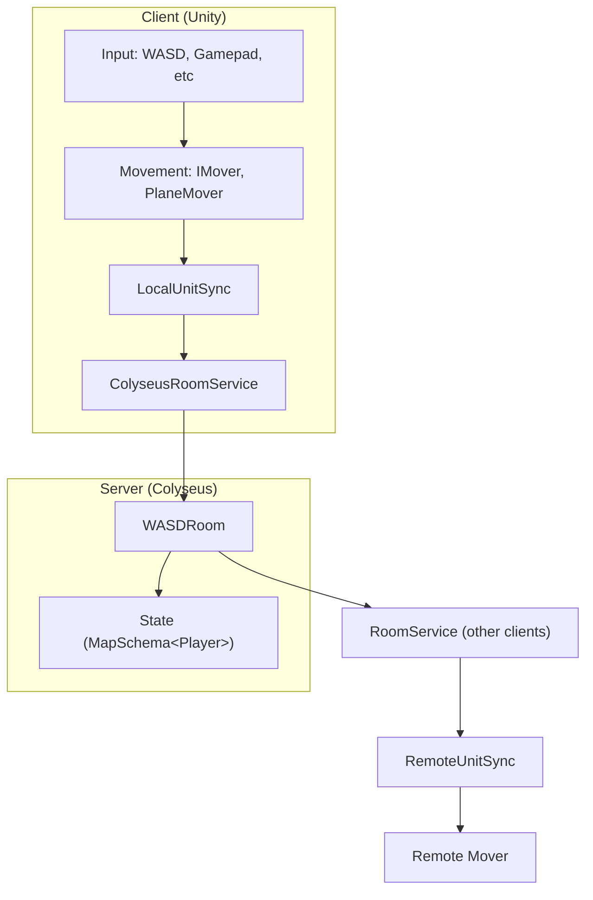

# 🪐 DigitalSpace Multiplayer Room (Unity + Colyseus)

Модульная мультиплеерная система, построенная на **Unity (Client)** и **Colyseus (Server)**.  
Проект реализует базовый пример — комнату с перемещением игроков по WASD  
и синхронизацией позиций через серверную комнату `WASDRoom`.

Архитектура следует принципам **SOLID**, **модульного монолита**  
и полностью разделяет клиентскую и серверную части.

---

## 🧱 Общая архитектура

| Модуль              | Задача                                                                           | Зависимости   |
| ------------------- | -------------------------------------------------------------------------------- | ------------- |
| **Input**           | Считывание пользовательского ввода, расширяемые источники (WASD, геймпад и т.д.) | –             |
| **Movement**        | Перемещение по плоскости, интерфейс IMover, базовая физика                       | Input         |
| **Net**             | Синхронизация с сервером Colyseus, управление комнатами                          | Movement      |
| **Gameplay**        | Координация игроков, спавн локальных и удалённых юнитов                          | Net, Movement |
| **CompositionRoot** | Точка входа, создаёт все сервисы и связывает модули                              | Всё           |

## 🔄 Поток выполнения

1. **CompositionRoot** запускает GameCompositionRoot → создаёт ColyseusNetworkClient, ColyseusRoomService, PlayerPresenter

2. **PlayerPresenter** подключается к комнате → спавнит локального игрока (LocalUnitSync)

3. Локальный игрок двигается (PlaneMover ← WasdInputSource)

4. Каждые N мс (NetConfig.SendRate) отправляется позиция на сервер

5. Сервер обновляет State.players и рассылает патч

6. Удалённые клиенты получают OnChange → RemoteUnitSync.PushPosition()

7. RemoteUnitSync интерполирует плавное движение остальных игроков

## 🧠 Принципы архитектуры

* **SOLID** — каждый класс отвечает за один аспект (например, IMover ≠ ввод ≠ сеть)

* **Модульный монолит** — отдельные namespace и сборки (.asmdef)
позволяют развивать проект независимо без жёстких зависимостей

* **Dependency Injection (Composition Root)** — все зависимости создаются в GameCompositionRoot,
а не через синглтоны или DI контейнеры

## ⚙️ Настройка проекта

**1. Colyseus Server**
 * Запусти сервер npm run dev
 * Адрес по умолчанию: ws://localhost:2567

**2. Unity**
 * Установи пакет colyseus-unity версии 0.14.x
 * Подключи префабы:
    - PlayerLocal.prefab
    - PlayerRemote.prefab

 * Создай конфиги:
    - MovementConfig.asset
    - NetConfig.asset

 * Добавь GameCompositionRoot на сцену

 * Play

**3. Запусти сервер**

**4. Запусти сцену в Unity**

